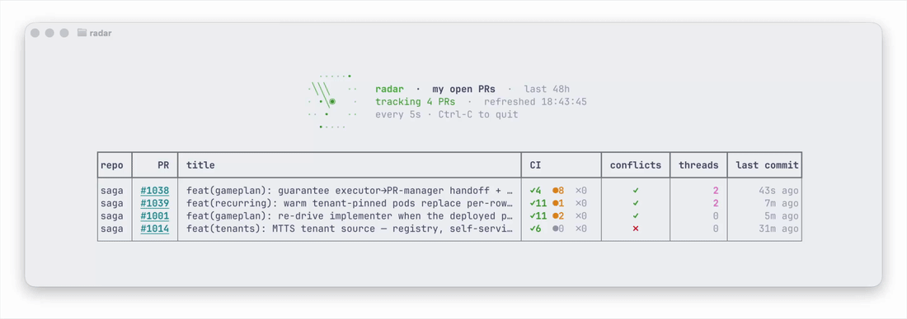

<div align="center">



<em>your open GitHub PRs on a live sweep</em>

</div>

# radar

A live terminal dashboard for the GitHub PRs you recently opened. It shows every
**open PR you authored within the last 48h** and refreshes every 5 seconds.

A little ASCII radar sweep spins in the header (each tracked PR is a blip that pings
when the beam passes over it), and the whole view is centered on screen. The `gh`
fetch runs on a background thread so the sweep stays smooth while data loads.

Columns: **repo · PR# (clickable) · title · CI checks (✓ green / ● pending / ✗ failed) · conflicts (✓ clean / ✗ conflicting) · open review threads · last commit**

It reads data through your existing `gh` login (one GraphQL search call per refresh),
so there's nothing to configure.

## Run

```bash
./radar                 # last 48h, refresh every 5s
./radar --hours 12      # widen/narrow the window
./radar --interval 10   # poll less often
./radar --no-drafts     # hide draft PRs
```

Quit with **Ctrl-C**. Click a `#1234` to open the PR in your browser (works in Ghostty
and any terminal that supports OSC-8 hyperlinks).

### Run from anywhere

A symlink on your `PATH` lets you call `radar` from any directory:

```bash
ln -sf "$PWD/radar" ~/.local/bin/radar   # ~/.local/bin is already on PATH
radar                                     # now works from anywhere
```

The launcher resolves the symlink back to this folder, so it always uses the bundled
`.venv` and `radar.py` no matter where it's invoked from. To uninstall, just
`rm ~/.local/bin/radar` (the project itself is untouched).

## CI status legend

| Symbol | Meaning |
|--------|---------|
| `✓ passing` | all checks succeeded |
| `✗ failing` / `✗ error` | a check failed or errored |
| `● running` / `● queued` | checks in progress |
| `– no checks` | no CI configured / no checks yet |

The **threads** column counts *unresolved* review threads. If a refresh fails
(network blip, `gh` hiccup), the last good table stays on screen with a warning banner.

## Authentication

radar does **not** handle GitHub auth itself and stores no token. Each refresh shells
out to `gh api graphql ...`, and the `gh` CLI attaches your credentials automatically.

- **Who it acts as:** whoever `gh auth status` reports. radar only sees PRs that account
  can see, so your private/org repos are included.
- **Where the token lives:** in `gh`'s own credential store (the macOS **keyring**), not
  in this project. There is no token in the code, no `.env`, and nothing to configure.
- **How `gh` picks the token:** it uses `GH_TOKEN` / `GITHUB_TOKEN` if either env var is
  set, otherwise the stored keyring login.
- **Required scope:** the token needs `repo` (to read PRs, check status, and review
  threads). A classic PAT or the scopes from `gh auth login` both work.
- **If auth breaks** (logged out, expired token): the GraphQL call fails and radar shows a
  `⚠ couldn't refresh: …` banner while keeping the last good table on screen. Fix it with
  `gh auth login` — no change to radar needed.

To check or (re)establish auth:

```bash
gh auth status        # see who you're logged in as and which scopes
gh auth login         # log in / refresh if needed
```

## Requirements

- `gh` CLI, authenticated (`gh auth status`)
- Python 3.9+ with the bundled `.venv` (created with `python3 -m venv .venv && .venv/bin/pip install rich`)
